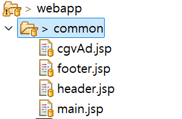
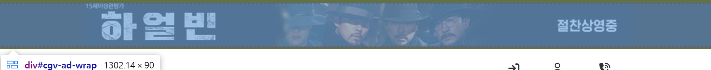
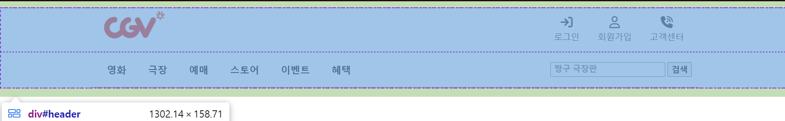
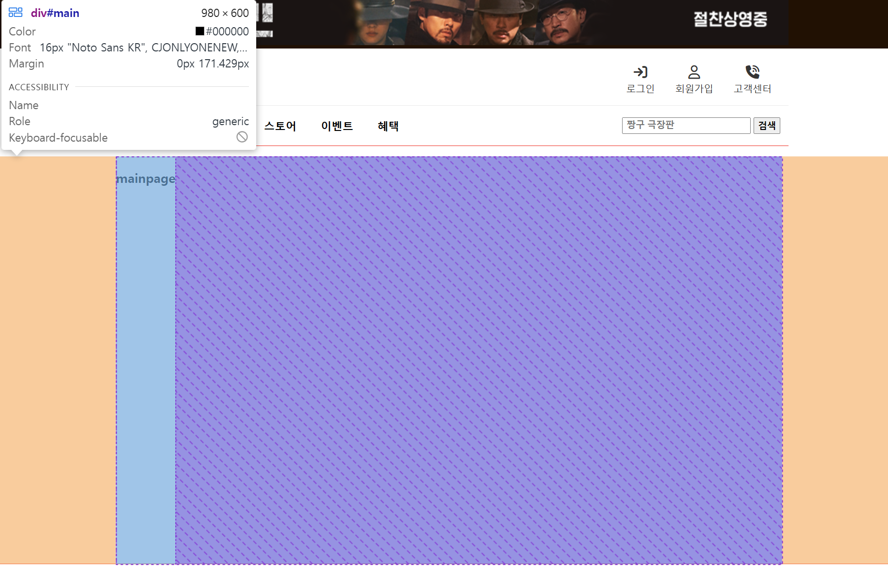
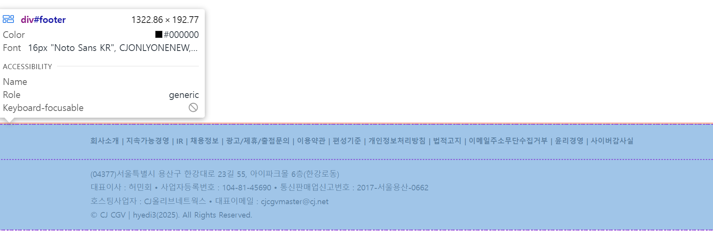

## COMMON 폴더 구성 
 <br/>
> \- [x] cgvAd.jsp(최신 상영 영화 광고 배너) <br/>
> \- [x] header.jsp(최상단 내비게이션 바를 담은 헤더 페이지) <br/>
> \- [ ] main.jsp(영화관 메인페이지) <br/>
> \- [x] footer.jsp(최하단 회사 소개 및 정보 페이지)<br/>

<br/>

### 🎬 cgvAd.jsp
최신 상영 영화 광고 배너 페이지<br/><br/>
<br/>
> \- [ ] `[#cgv-ad-wrap]` : 상영 영화 예매 페이지로 이동  <br/>

<br/>

### 👻 header.jsp 
최상단 내비게이션 바를 담은 헤더 페이지 <br/><br/>
<br/>
> \- [X] `[#headerContents]` : 로그인(login.do), 회원가입(join.do), 고객센터(csr.do) <br/>
> \- [ ] `[#navContents]` : 영화(미완성), 극장(상영관, theater.do), 예매(미완성), 스토어(미완성), 이벤트(미완성), 혜택(미완성) <br/>
> \- [ ] `[#navSearch]` : 검색창 <br/>

<br/>

### 🍿  main.jsp 
영화관 메인페이지(홈페이지, 미완성) <br/><br/>
<br/>
```jsp
<head>
<!-- [css] -->
<!-- el, jstl로 선언한 링크를 setting.jsp 변수에 담고 링크를 수정할 수 있어서, 
     include file로 선언한 링크 빼고, 모든 링크를 프로젝트명부터 시작한다. -->
<link rel="stylesheet" href="/mvc_jsp_movie/resources/css/common/common.css">
<link rel="stylesheet" href="/mvc_jsp_movie/resources/css/common/cgvAd.css">
<link rel="stylesheet" href="/mvc_jsp_movie/resources/css/common/header.css">
<link rel="stylesheet" href="/mvc_jsp_movie/resources/css/common/footer.css">
<link rel="stylesheet" href="/mvc_jsp_movie/resources/css/common/main.css">
</head>
<body>
	<div id="cgvWrap">
		<!-- ad banner page -->
		<%@ include file="/common/cgvAd.jsp" %>
		
		<!-- header page -->
		<%@ include file="/common/header.jsp" %>
	
		<!-- main page -->
		<div id="main"> <h3>mainpage</h3></div>
		
		<!-- footer page -->
		<%@ include file="/common/footer.jsp" %>		
	</div>
</body>
```
<br/>

### 🏢 footer.jsp 
최하단 회사 소개 및 정보 페이지<br/><br/>
<br/>
> \-  `[#footerContents]` : 회사소개, 지속가능경영, IR ....(미완성) <br/>
> \-  `[#companyInfo]` : 회사 위치, 회사대표 정보, 저작권 표시

<br/>