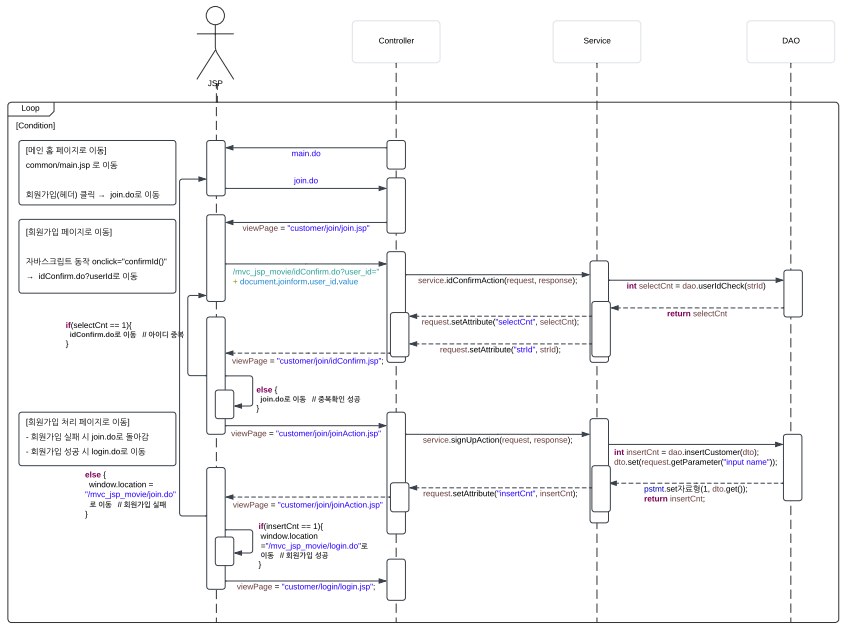

# 🪪 Customer > JOIN (고객 회원가입 섹션)
 <br/>
> ☑️ ***join.jsp*** (고객 회원가입 폼 페이지) <br/>
> ☑️ ***joinAction.jsp*** (회원가입 성공/실패 안내 창 페이지, 컨트롤러가 성공여부를 거쳐가는 페이지) <br/>
> ☑️ ***idConfirm.jsp*** (ID 중복확인 창) <br/>
<br/>

## 🤹 join.jsp 
고객 회원가입 페이지 <br/>

 <br/>

### 🧠 \<head> 부분
```jsp
<head>
	<!-- [css] -->
	<link rel="stylesheet" href="/mvc_jsp_movie/resources/css/common/common.css">
	<link rel="stylesheet" href="/mvc_jsp_movie/resources/css/common/cgvAd.css">
	<link rel="stylesheet" href="/mvc_jsp_movie/resources/css/common/header.css">
	<link rel="stylesheet" href="/mvc_jsp_movie/resources/css/common/footer.css">
	<link rel="stylesheet" href="/mvc_jsp_movie/resources/css/customer/join.css">

	<!-- 다음 API 우편주소 찾기 -->
	<script src="//t1.daumcdn.net/mapjsapi/bundle/postcode/prod/postcode.v2.js"></script>
	<script src="/mvc_jsp_movie/resources/js/customer/join/daumAdressAPI.js" defer></script>  

	<!-- join.js -->
	<script src="/mvc_jsp_movie/resources/js/customer/join/join.js" defer></script> 
</head>
```

> `[defer]` <br/>
  \- 브라우저는 HTML을 로드할 때 **\<script>..\</script>를 만나면**, ***DOM 생성을 멈추고 스크립트를 우선 실행***한다. <br/>
  \- 즉, 스크립트 아래의 DOM 요소에 접근할 수 없다. 스크립트의 내용이 많으면 페이지 로딩이 느려질 수 밖에 없거나 **최악의 경우 스크립트 실행만 반복하고 DOM 생성이 불가능할 수 있다.** <br/>
  \- 브라우저는 **defer 속성의 스크립트**를 백그라운드에서 다운로드한다. ***즉, 페이지 구성(HTML 파싱)이 완료될 때까지 스크립트 동작이 지연***된다. <br/>
  \- **단, defer 속성은 외부 스크립트에서만 유효하다.** <br/>

<br/>

### 📝 \<form> 부분
```jsp
<!-- href 링크 연결은 /mvc_jsp_movie/~.do이고, action 연결은 .do만 작성 -->		
<form name="joinform" action="/mvc_jsp_movie/joinAction.do" method="post" onsubmit="return signInChk()">
</form>
```

> `[action]` <br/>
  ***submit 버튼 클릭 활성화 시***, 서버를 통해 보내질 **폼 데이터의 도착 URL을 명시하는 속성** <br/>
	<br/>
> `[method]` <br/>
	***폼 데이터(form data)가 서버로 제출될 때*** 사용되는 **HTTP 메소드를 명시**, (get/post 방식으로 구분) <br/>
	<br/>
>  `[POST]` <br/>
	POST 방식은 **폼 데이터를 별도로 첨부하여 서버로 전달하는 방식** (보안성이 높음) <br/>
	<br/>
>  `[GET]` <br/>
	POST 방식은 URL에 **폼 데이터를 추가하여 서버로 전달하는 방식**, 보통 ***'쿼리 문자열'(query string)에 포함되어 전송*** (보안 취약) <br/>
	<br/>
>  `[onSubmit]` <br/>
	\- **form 태그 내부에서 \<input type='submit'>로 인해 발생하는 이벤트를 처리** <br/>
	\- 이벤트 발생과 action에 지정된 URL이 적용되는 그 사이의 시점에 처리할 동작<br/>
	\- ***일반적으로 "자바스크립트 함수를 지정"하여 처리*** <br/>
	\- 연결된 함수에서 true를 반환하면 form이 전송되고, false를 반환한다면 form이 전송되지 않는다.<br/>

<br/>

### 👤 \<input type="hidden"> 부분
```jsp
<!--  [1-1] signInChk(): 중복 확인 버튼 클릭 여부 체크 (0: 클릭 안함, 1: 클릭함) -->
<input type="hidden" name="hiddenUserId" value="0">
```

> `[hidden]` <br/>
  사용자가 시각적으로 보거나 직접 수정할 수 없는 값을 나타내는 숨겨진 필드

```js
// 1. onsubmit - 회원가입 페이지 필수 체크
// : form 태그 내부에서 <input type='submit'>로 인해 발생하는 이벤트를 처리
function signInChk() {
	// [1-2] joinform의 form 태그 내부 hiddenUserId(input name)의 value가 0일 때, 
	if(document.joinform.hiddenUserId.value == "0") {
		alert("중복 확인 해주세요.");
		document.joinform.dubChk.focus();  // dubChk(input name)로 포커스 
		return false;  // click 이벤트 조건이 실행되면, false값을 반환해 위 기능들 동작 반복 중지
	}
}
```

<br/>

### 💡 필수 입력 폼 설정 (+js 설정)
아이디, 비밀번호, 비밀번호(확인), 이름, 생년 월일, 핸드폰 번호,  주소와 같은 정보를 '고객 필수 입력 폼'으로 설계한다. 
<br/>

#### ✒️ 아이디 (user_id)
아이디가 중복되는지 여부를 판별하기 위해 중복확인 함수를 추가하였다. <br/>

 <br/>
```jsp
<input type="text" class="input1" name="user_id" placeholder="공백없이 20자 이내로" required autofocus>
<!-- onclick : 객체를 클릭했을 때 발생하는 이벤트 -->
<input type="button" name="dubChk" value="중복확인" onclick="confirmId()">
```
> `[placeholder]` <br/>
  입력 필드에 사용자가 적절한 값을 입력할 수 있도록 도와주는 짧은 도움말을 명시 ***(작성할 내용 힌트)*** <br/>
	<br/>
> `[required]` <br/>
  *폼 데이터(form data)가 서버로 제출되기 전*, **'반드시' 채워져 있어야 하는 입력 필드를 명시**<br/>
	<br/>
> `[autofocus]` <br/>
  *페이지가 로드될 때*, 해당 input 요소로 **자동 포커스(focus)**<br/>
	<br/>
> `[type="button"]` <br/>
  버튼 생성 (데이터가 서버로 전송되지 않음, submit과 차이)<br/>
	<br/>
> `[onclick]` <br/>
  객체를 클릭했을 때 발생하는 이벤트(지정한 함수로 이동)<br/>

```js
// 2. onclick="confirmId()" : 아이디 입력 후, 중복 확인 버튼 클릭
function confirmId() {
	// [2-1] joinform의 form 태그 내부 user_id(input name)의 value가 없을 때 if문 실행
	if(!document.joinform.user_id.value) {
		alert("아이디를 입력해주세요!");
		document.joinform.user_id.focus();   // user_id(input name)로 포커스 
		return false;  // user_id의 value가 발생하면, false값을 반환해, if문 탈출
	}
	
	// [2-2] 아이디 입력 후, 중복 확인 버튼 클릭 시 : 컨트롤러로 url 전달
	// 쿼리스트링 사용 (URL의 뒤에 입력 데이터를 함께 제공하는 가장 단순한 데이터 전달 방법 - url 주소?key=value&key2=value2) 
	// : user_id= + 입력한 value값을 url 변수에 담음 
	let url = "/mvc_jsp_movie/idConfirm.do?user_id=" + document.joinform.user_id.value;

	// window.open( ) :  웹브라우저에서 새창(팝업창)을 여는 함수 
	// open() 함수의 속성들 | 1. 팝업 주소 : url(위에 선언한 변수 사용), 2. 새로 열리는 창(팝업창)의 이름을 지정 : "confirm" , 3. 팝업창 설정 : "menubar=no" : 메뉴바 없이 창 생성
	window.open(url, "confirm", "menubar=no, width=550, height=300");  
}
```

<br/>

#### ✒️ 주소 (user_address)
우편번호 찾기는 카카오(구 다음)에서 제공하는 오픈 API를 사용하였다. <br/><br/>

 <br/>
```jsp
<input type="text" class="input1"  id="sample6_postcode" name="user_address1" size="10" placeholder="우편번호" style="width: 100px; padding: 8px;" required>
<!-- onclick : 객체를 클릭했을 때 발생하는 이벤트(지정한 함수로 이동) -->
<input type="button" name="addressChk" value="우편번호 찾기" onclick="sample6_execDaumPostcode()">
</div>
<input type="text" class="input1" id="sample6_address" name="user_address2" size="50" placeholder="주소" required>
<div id="detailExtra">
<input type="text" class="input5" id="sample6_detailAddress" name="user_address3" size="50" placeholder="상세주소" required>
<input type="text" class="input5" id="sample6_extraAddress" name="user_address4" size="50" placeholder="참고항목">
```
> `[onclick]` <br/>
  객체를 클릭했을 때 발생하는 이벤트(지정한 함수 ***(sample6_execDaumPostcode())*** 로 이동)<br/>
```js
// 다음 우편 번호 주소 찾기 js
function sample6_execDaumPostcode() {
	// new daum.Postcode(): Daum에서 제공하는 우편번호 검색 기능을 사용하기 위해 새로운 객체를 생성
    new daum.Postcode({
	    // oncomplete 함수 실행 (사용자가 우편번호 검색을 완료하고 선택했을 때 실행)
        oncomplete: function(data) {
            // 팝업에서 검색결과 항목을 클릭했을때 실행할 코드를 작성하는 부분.

            // 각 주소의 노출 규칙에 따라 주소를 조합한다.
            // 내려오는 변수가 값이 없는 경우엔 공백('')값을 가지므로, 이를 참고하여 분기 한다.
            var addr = ''; // 주소 변수
            var extraAddr = ''; // 참고항목 변수

            //사용자가 선택한 주소 타입에 따라 해당 주소 값을 가져온다.
            if (data.userSelectedType === 'R') { // 사용자가 도로명 주소를 선택했을 경우
                addr = data.roadAddress;
            } else { // 사용자가 지번 주소를 선택했을 경우(J)
                addr = data.jibunAddress;
            }

            // 사용자가 선택한 주소가 도로명 타입일때 참고항목을 조합한다.
            if(data.userSelectedType === 'R'){
                // 법정동명이 있을 경우 추가한다. (법정리는 제외)
                // 법정동의 경우 마지막 문자가 "동/로/가"로 끝난다.
                if(data.bname !== '' && /[동|로|가]$/g.test(data.bname)){
                    extraAddr += data.bname;
                }
                // 건물명이 있고, 공동주택일 경우 추가한다.
                if(data.buildingName !== '' && data.apartment === 'Y'){
                    extraAddr += (extraAddr !== '' ? ', ' + data.buildingName : data.buildingName);
                }
                // 표시할 참고항목이 있을 경우, 괄호까지 추가한 최종 문자열을 만든다.
                if(extraAddr !== ''){
                    extraAddr = ' (' + extraAddr + ')';
                }
                // 조합된 참고항목을 해당 필드에 넣는다.
                document.getElementById("sample6_extraAddress").value = extraAddr;
            
            } else {
				// 참고 항목이 없을 시 ''로 값 초기화 
                document.getElementById("sample6_extraAddress").value = '';
            }

            // 우편번호와 주소 정보를 해당 필드에 넣는다.
            document.getElementById('sample6_postcode').value = data.zonecode;   // zonecode : 국가기초구역번호 (새 우편번호)
            document.getElementById("sample6_address").value = addr;
            
            // 커서를 상세주소 필드로 이동한다.
            document.getElementById("sample6_detailAddress").focus();
        }
    }).open();
}
```
<br/>

### ➕ 부가 입력 폼 설정
이메일, 전화번호와 같은 선택 입력 사항을 '고객 부가 입력 폼'으로 설계한다.  <br/>

#### ✒️ 이메일  (user_email)
현재 가장 많이 사용되는 google,  naver, kakao, nate를 옵션으로 제공하고, 그 외의 이메일은 직접 입력으로 입력받는다.  <br/><br/>
```jsp
<input type="text" class="input4" name="user_email1">
@
<input type="text" class="input3" name="user_email2">
<!-- onchange: 객체의 내용(이벤트)이 변경되었을 때 사용(주로 select문) -->
<select name="user_email3" onchange="selectEmailChk()" style="width: 106px;">
<option value=""> 직접입력 </option>
<option value="google.com"> 구글 </option>
<option value="naver.com"> 네이버 </option>
<option value="kakao.com"> 카카오 </option>
<option value="nate.com"> 네이트 </option>
</select>
```
> `[onchange]` <br/>
  사용자가 *입력 필드의 내용을 변경할 때*마다, ***onchange 이벤트 발생(selectEmailChk() 함수로 이동)***. 사용자가 select, text, textarea의 텍스트를 변경하면 지정한 이벤트 발생 <br/>
```js
// 3. onchange="selectEmailChk()" - 이메일 타입 체크
function selectEmailChk() {
	if(!document.joinform.user_email3.value){  // user_email3.value가 null일때,
		document.joinform.user_email2.value = "";   // 직접 입력 선택 시, user_email2 값 초기화 (공백없어야 함, null != 공백)
		document.joinform.user_email2.focus();  // user_email2로 focus 
	}
	else {
		// user_email3 value 선택 시, user_email2에 user_email3 value 담기
		document.joinform.user_email2.value = document.joinform.user_email3.value;
		return false;
	}
}
```
<br/>

#### ✒️ 전화번호 (user_tel)
현재 가장 많이 사용되는 지역번호들을 옵션으로 제공한다.  <br/>
```jsp
<!-- onchange: 객체의 내용(이벤트)이 변경되었을 때 사용(주로 select문) -->
<select name="user_tel1" onchange="selectTel1Chk()">
	<!-- 총 16개의 지역 전화번호 -->
	<option value=""> 지역번호 선택 </option>
	<option value="02"> 02(서울) </option>
	<option value="031"> 031(경기) </option>
	<option value="032"> 032(인천) </option>
	<option value="033"> 033(강원) </option>
	<option value="041"> 041(충남) </option>
	<option value="042"> 042(대전) </option>
	<option value="043"> 043(충북) </option>
	<option value="051"> 051(부산) </option>
	<option value="052"> 052(울산) </option>
	<option value="053"> 053(대구) </option>
	<option value="054"> 054(경북) </option>
	<option value="055"> 055(경남) </option>
	<option value="061"> 061(전남) </option>
	<option value="062"> 062(광주) </option>
	<option value="063"> 063(전북) </option>
	<option value="064"> 064(제주) </option>
</select>
-
<input type="text" class="input3" name="user_tel2" size="4" >
-
<input type="text" class="input3" name="user_tel3" size="4" >
```
> `[onchange]` <br/>
  사용자가 *입력 필드의 내용을 변경할 때*마다, ***onchange 이벤트 발생(selectTel1Chk() 함수로 이동)***. <br/>
```js
// 4. onchange="selectTel1Chk()" - 지역 번호 체크
function selectTel1Chk() {
	if(!document.joinform.user_tel1.value){       // user_tel1.value가 null일 때, 
		document.joinform.user_tel1.value = "";  // 지역번호 선택 시, user_tel1 null로 초기화 (공백없어야 함, null != 공백)
	}
}
```
<br/> 

## 🤹 idConfirm.jsp
아이디 중복확인 성공/실패 자식 창 페이지, 컨트롤러가 성공여부를 거쳐가는 페이지 <br/>
(자바스크립트의 alert 메서드를 사용하기 위해서는 jsp환경이 필요하기 때문, ServiceImpl.java에서 처리 불가)
```jsp
<form name="confirmForm" action="/mvc_jsp_movie/idConfirm.do" method="post">

	<!-- 필수 입력 폼 -->
	<div class="confirmForm">
			<%
				int selectCnt = (Integer)request.getAttribute("selectCnt");
				String strId = (String)request.getAttribute("strId");
				
				// 아이디가 중복일 때 
				if(selectCnt == 1){
			%>

		<div class="infoInput">
			<div id="comfirmId"> 사용 불가한 아이디(<%=strId %>)입니다. </div>
		</div>
		<div class="infoInput">
			<div class="inputText">
				<span> 아이디 </span><span class="requiredAll">*</span>
			</div>
			<div class="inputType">
				<input type="text" class="input1" name="user_id" placeholder="공백없이 20자 이내로" required autofocus>
				<input type="submit" value="중복확인" >
			</div>
		</div>
		<%  }
			else {
		%>
		<div class="infoInput">
			<div id="comfirmId"> 사용 가능한 아이디(<%=strId %>) 입니다. </div>
		</div>
		<div class="infoInput">
			<div class="inputType2">
				<!-- onclick : 객체를 클릭했을 때 발생하는 이벤트(지정한 함수로 이동) -->
				<input type="button" value="확인" onclick="setUserId('<%=strId%>')">
			</div>
		</div>
		<%  }
		%>
	</div>
</form>
```
<br/>

## 🤹 joinAction.jsp
회원가입 성공/실패 안내 창 페이지, 컨트롤러가 성공여부를 거쳐가는 페이지 <br/>
(자바스크립트의 alert 메서드를 사용하기 위해서는 jsp환경이 필요하기 때문, ServiceImpl.java에서 처리 불가)

```jsp
<% 
	int insertCnt = (Integer)request.getAttribute("insertCnt");
	
	if(insertCnt == 1){
%>
	<script type="text/javascript">
		alert("회원 가입 성공");
		window.location="/mvc_jsp_movie/login.do"
	</script>
<%
	}

	else{
%>
				
	<script type="text/javascript">
		alert("회원 가입 실패");
		window.location="/mvc_jsp_movie/join.do"
	</script>
<%
	}

%>
```
<br/>

## 🤹 시퀀스 다이어그램
회원가입 동작 구조 (Controller - Service - DAO - jsp)<br/>

 <br/>
