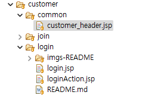
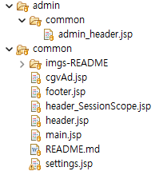
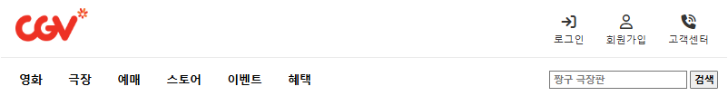
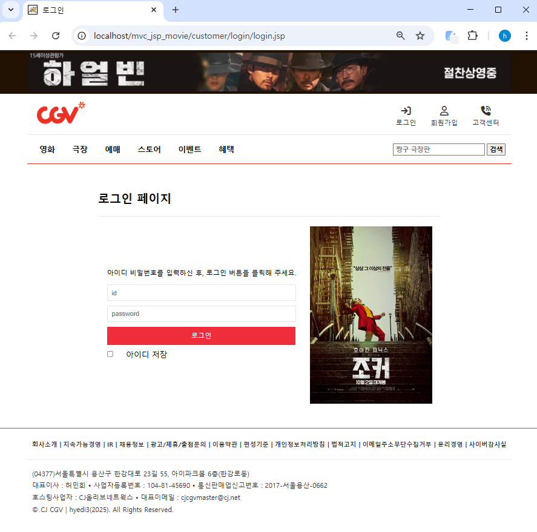
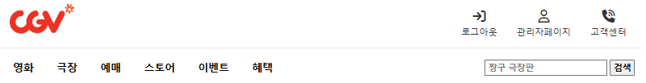
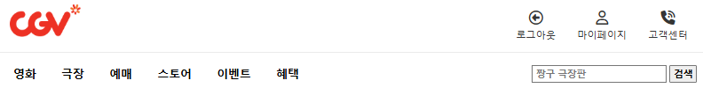

# 🪪 Customer > login (로그인 섹션) | JSTL.ver
> 💡 **백엔드 영역은 PullRequest 커밋 참조** <br/>

<br/>

 <br/>
> ☑️ ***customer_header.jsp*** *(login_session이 '고객'인 경우의 로그인 헤더)* <br/>
> ☑️ ***login.jsp*** *(로그인 폼 페이지)* <br/>
> ☑️ ***loginAction.jsp*** *('로그인 성공/실패 안내 창' 페이지, 컨트롤러가 성공여부를 거쳐가는 페이지)* <br/>

<br/>

 <br/>
> ☑️ ***admin_header.jsp*** *(login_session이 '관리자'인 경우의 로그인 헤더)* <br/>
> ☑️ ***header.jsp*** *(login_session이 'null인 경우'의 헤더)* <br/>
> ☑️ ***header_SessionScope.jsp*** *(`login_session 여부`에 따라 '페이지 이동 조건'이 담긴 헤더 페이지)* <br/>

<br/>

## 🤹 LOGIN.jsp 
로그인 페이지 화면 (어드민과 고객 세션 여부에 따라 알럿과 헤더가 달라진다.) <br/>

 <br/>
1
### 🔓 header.jsp (로그인 전 헤더)
`로그인`과 `회원가입`, `고객센터`로 로그인 전 화면 헤더를 구성하였다. <br/>

 <br/>
```jsp
<div id="header">
	<div id="headerContents">
		<a href="${path}/main.do"></a>
		<ul>
			<li><a href="${path}/login.do"><i class="fa-solid fa-arrow-right-to-bracket"></i>로그인</a></li>
			<li><a href="${path}/join.do"><i class="fa-regular fa-user"></i>회원가입</a></li>
			<li><a href="${path}/csr.do"><i class="fa-solid fa-phone-volume"></i>고객센터</a></li>
		</ul>			
	</div>
	<div id="nav">
		<div id="navContents">
			<a href="#">영화</a>
			<a href="${path}/theater.do">극장</a>
			<a href="#">예매</a>
			<a href="#">스토어</a>
			<a href="#">이벤트</a>
			<a href="#">혜택</a>
		</div>	
		<div id="navSearch">
			<input type="text" placeholder="짱구 극장판"> 
			<input type="submit" value="검색">
		</div>
	</div>
</div>
```
<br/>

<br/>

### 👀 login.jsp 부분
 <br/>

```jsp
<div id="loginWrap">
<!-- header_SessionScope.jsp : banner page & header page -->
<%@ include file="/common/header_SessionScope.jsp" %>

<!-- 로그인 페이지 -->
<div class="login_container">
	<div id="loginTitle">
		<h2> 로그인 페이지 </h2>
	</div>
	
	<div id="loginSection">	
		<div id="loginArticle">
			<form action="${path}/loginAction.do" method="post">
				<div id="loginInput">
					<p>아이디 비밀번호를 입력하신 후, 로그인 버튼을 클릭해 주세요.</p>
					<input type="text" name="user_id" placeholder="id">
					<input type="password" name="user_pwd" placeholder="password">	
					<input type="submit" value="로그인">	
					<input type="checkbox" value="saveId"> 아이디 저장
				</div>
			</form>
			<div id="login_ad">
				<a href="#"></a>
			</div>
		</div>
	</div>
</div>

<!-- footer page -->
<%@ include file="/common/footer.jsp" %>	
</div>
```
> `<input type="submit" value="로그인">` <br/>
  ***'submit 버튼 클릭 활성화 시'***,  ***action="${path}/loginAction.do"경로로 서버를 통해 데이터가 'post 방식'으로 컨트롤러에 보내진다.***<br/>

<br/>

### 🕹️ loginAction.jsp 부분
**'세션 여부에 따라' 헤더를 변경하기 위한 로그인 처리 페이지**이다. 

```jsp
<c:choose>
	<c:when test="${sessionScope.login_session eq 'Admin'}">
		<script type="text/javascript">
			alert("${sessionScope.sessionID}님 로그인 성공하였습니다.");
			window.location="${path}/main.do";
		</script>
	</c:when>
	
	<c:when test="${sessionScope.login_session eq 'Customer'}">
		<script type="text/javascript">
			alert("${sessionScope.sessionID}님 로그인 성공하였습니다.");
			window.location="${path}/main.do";
		</script>
	</c:when>
	<c:otherwise>
		<script type="text/javascript">
			alert("아이디와 비밀번호가 일치하지 않습니다!");
			window.location="${path}/login.do";
		</script>
	</c:otherwise>
</c:choose>
```
> `<c:when test="${sessionScope.login_session eq 'Admin'}">` <br/>
  ***'세션 값이 Admin일 시'***,  ***세션값을 유지한 채 main으로 이동한다. 메인의 헤더는 admin_header.jsp로 변경된다.***<br/>
>  
> `<c:when test="${sessionScope.login_session eq 'Customer'}">` 
  ***'세션 값이 Customer일 시'***,  ***세션값을 유지한 채 main으로 이동한다. 메인의 헤더는 customer_header.jsp로 변경된다.***<br/>
>
> `<c:otherwise>` <br/>
  ***'세션 값이 null일 시'***,  ***login.do(로그인페이지)으로 이동한다. 메인의 헤더는 header.jsp를 유지한다.***<br/>
>
> `세션에 대한 정보`
  컨트롤러에서 ***session.setAttribute***로 값을 담았다. (PullRequest 참조)

<br/>

### 🔓 admin_header.jsp (관리자 로그인 후 헤더)
로그인 후, '관리자 화면 헤더'를 `로그아웃`과 `관리자페이지`, `고객센터`로 구성하였다. <br/>

 <br/>

```jsp
<div id="header">
	<div id="headerContents">
		<a href="${path}/main.do"></a>
		<ul>
			<li><a href="${path}/logout.do"><i class="fa-solid fa-arrow-right-to-bracket"></i>로그아웃</a></li>
			<li><a href="${path}/myPage.do"><i class="fa-regular fa-user"></i>관리자페이지</a></li>
			<li><a href="${path}/board_list.bc"><i class="fa-solid fa-phone-volume"></i>고객센터</a></li>
		</ul>			
	</div>
	<div id="nav">
		<div id="navContents">
			<a href="#">영화</a>
			<a href="${path}/theater.do">극장</a>
			<a href="#">예매</a>
			<a href="#">스토어</a>
			<a href="#">이벤트</a>
			<a href="#">혜택</a>
		</div>	
		<div id="navSearch">
			<input type="text" placeholder="짱구 극장판"> 
			<input type="submit" value="검색">
		</div>
	</div>
</div>

```
<br/>

### 🔓 customer_header.jsp (고객 로그인 후 헤더)
로그인 후, '고객 화면 헤더'를 `로그아웃`과 `마이페이지`, `고객센터`로 구성하였다. <br/>

 <br/>

```jsp
<div id="header">
	<div id="headerContents">
		<a href="${path}/main.do"></a>
		<ul>
			<li><a href="${path}/logout.do"><i class="fa-solid fa-arrow-right-to-bracket"></i>로그아웃</a></li>
			<li><a href="${path}/myPage.do"><i class="fa-regular fa-user"></i>관리자페이지</a></li>
			<li><a href="${path}/board_list.bc"><i class="fa-solid fa-phone-volume"></i>고객센터</a></li>
		</ul>			
	</div>
	<div id="nav">
		<div id="navContents">
			<a href="#">영화</a>
			<a href="${path}/theater.do">극장</a>
			<a href="#">예매</a>
			<a href="#">스토어</a>
			<a href="#">이벤트</a>
			<a href="#">혜택</a>
		</div>	
		<div id="navSearch">
			<input type="text" placeholder="짱구 극장판"> 
			<input type="submit" value="검색">
		</div>
	</div>
</div>

```
