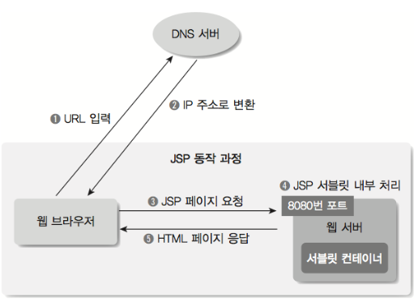
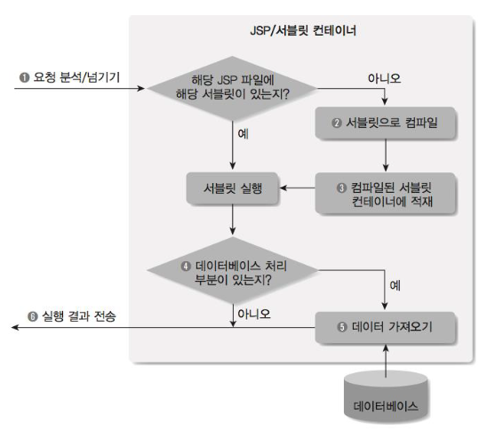
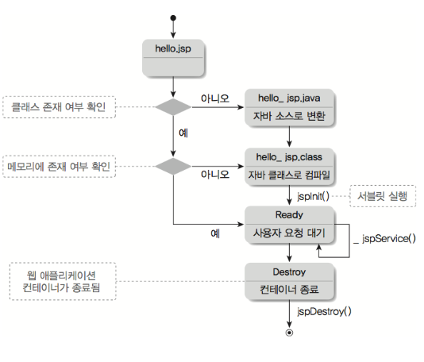

## 🧐 JSP
### 🎓 JSP의 정의
>- `JSP`는 **서블릿의 화면단 처리의 어려움을 해결**하기 위해 등장. 
>- **서블릿에서 데이터를 표현함에 있어** '***불편함을 해소***'하기 위해 나온 `<뷰 템플릿 기술>`이다. 
>- **[HTML 형식의 문서 구조]** 에 `자바 코드` 혹은 `다른 전용 표기법`**을 사용**해 프로그램 요소를 쉽게 구현한다. 

> **[HTML과 JSP의 차이]** ⭐  
> - `HTML` : 단순히 서버 파일을 웹브라우저로 전달 
> - `JSP` : *서버에서 프로그램 실행 결과를* ***HTML로 변형*** → **"웹 브라우저로 전달"** 한다. 

 

### 🪄 JSP의 특징
>- 'HTML 페이지'에 **자바 코드를 직접 사용**한다. 
>- **'서블릿 컨테이너에 의해 관리'되는** **[내장 객체의 생명 주기]를 이용** → ***"페이지 간 속성을 관리"*** 한다. 
>- `커스텀 태그 기술`을 사용 → ***"코드를 태그화(action, JSTL)"***
>- `EL(Expression Language)`를 통해 ***"데이터를 표현"*** 한다. 

 

### ⚙️ JSP의 구성요소
> 각각의 구성 요소는 고유의 표기법과 속성을 가지지만, [서블릿 형태의 소스로 변환되는 과정]에서 **자바 코드로 변환**된다. 

>- **지시어** (Standard Directives)
>- **액션** (Standard Action)
>- **템플릿 데이터** (Template Data)
>- **스크립트 요소** (Script Element)
>- **커스텀 태그와 EL 표현언어** (Custom Tag & Expression Langaugae)

 

### 🔩 JSP 동작 과정
'웹 서버'가 *요청 내용을 분석* → *[서블릿 컨테이너에 전달]* → ***HTML문서 형태를 반환하는 과정***이다.  
  
> ① `웹브라우저`에서 **URL을 입력**한다.  
> ② `DNS 서버`로부터 입력한 **URL을 변환한 'IP주소'를 받는다.**  
> ③ **받은 IP 주소의** ***웹 서버 8080번 포트에*** `JSP페이지를 요청`한다.  
> ④ `웹 서버`가 **요청 내용을 분석**하고, ***서블릿 컨테이너에 요청을 넘겨 처리***한다.  
> ⑤ 화면에 보일 내용을 `HTML 문서 형태`로 **웹브라우저에 전송**한다. 

 

### 🔩 JSP/Servlet 컴파일 처리 과정
`JSP`는 **HTML과 같은 '텍스트 파일 구조'** , `서블릿`은 **'JAVA 소스로 작성된 파일 구조'** 이다. ***'JSP와 서블릿 파일'*** → ***웹 어플리케이션 서버에서 "서블릿 컨테이너에 의해" 실행 환경***이 제공된다.  

  
> ① `웹브라우저 → 웹 서버`로 **JSP에 대한 사용자 요청**이 **'컨테이너로 전달'** 된다.  
> ② **'요청 JSP 에 대한 서블릿이 존재'** 하면 **[서블릿 실행]** / **'존재하지 않을 경우'**, **[JSP를 .java 파일로 변환한 다음 .class 파일로 컴파일]** 한다.  
> ③ `컴파일된 서블릿 클래스`를 **컨테이너의 메모리에 적재 후, 실행**한다.  
> ④,⑤ *데이터베이스 처리 혹은 별도의 기능을 위한* `클래스 호출` 등이 있다면, **클래스를 실행하고 결과를 HTML 형태로 구성**한다.  
> ⑥ `HTML 형태의 결과`를 **웹 서버를 경유해 사용자 브라우저에 전달**한다. 

 

### 🔩 JSP/Servlet 변환과 상태 변화 
- `JSP`는 기본적으로 HTML 문서의 텍스트 파일 형식이지만, **'컴파일 후' 컨테이너에서 "서블릿 객체"로서 관리**된다. 
  > 즉, ***컴파일 후*** → ***JSP는 '파일 처리가 아닌' 컨테이너에 로드된 "서블릿으로 동작"*** 한다.  
  > ❗따라서, 서블릿 컨테이너는 `JSP파일`을 **'.java 소스코드'로 변환하여 컴파일을 수행** 한다. 
  
    

  ① `hello.jsp 형식`의 **웹 어플리케이션을 배포**한다.  
  ② **'클라이언트 요청'** 에 `컨테이너`는 **.jsp의 클래스 변환 여부를 확인**한다.  
  ③ **.jsp가 클래스로 변환되지 않았다면** → `컨테이너`는 **hello_jsp.java 파일을 생성**하고, **'.class로 컴파일'** 한다.  
  ④ **'서블릿으로 변환된 JSP'** 는 `jspInit() 메서드`**에 의해 실행**되어, **[READY 상태]** 가 된다.  
  ⑤ **'클라이언트 요청'** 은 `_jspService() 메서드`**가 [스레드 형태로 호출]** 되어 실행된다.  
  ⑥ **컨테이너에 의해 JSP 서블릿이 종료될 때**에는 `jspDestroy()` 메서드가 호출되어 종료된다.  