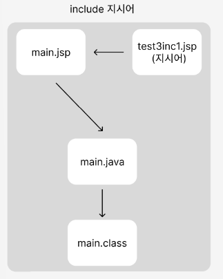

## 🧐 JSP 지시어
### 🎓 지시어란?
>- `지시어(Directives)`는 해당 JSP 페이지의 처리방법을 JSP엔진에 전달하는 역할을 한다.

<br/>

### ⚙️ 지시어의 종류
|지시어의 이름 | 설명 |
|---|---|
| `page 지시어` | **JSP 페이지에 대한 '정보를 설정'** 한다. |
| `include 지시어` | **외부 파일을 '현재 JSP페이지에 포함'** 시킨다. |
| `taglib 지시어` | **표현 언어에서 사용할 '자바 클래스'나 'JSTL'을 [선언]** 한다. |

<br/>

### 🔩 page 지시어
JSP 페이지를 `컨테이너`**에서 '처리(서블릿으로 변환)'하는데 필요한 각종 "속성을 기술하기 위해 사용"** 한다. 
```JSP
<%-- page 지시어 형식 --%>
<%@ page language="java" contentType="text/html; charset=UTF-8" pageEncoding="UTF-8"%>
```

|page 지시어 속성 | 설명 |
|---|---|
| `info` | 페이지에 대한 설명을 입력 |
| `language` ⭐ | 페이지에서 사용할 스크립팅 언어를 지정 (java)|
| `contentType` ⭐ | 페이지에서 생성할 MIME 타입(문서 타입)을 지정 (text/html) |
| `pageEncoding` ⭐ | charset과 같이 인코딩을 지정 |
| `import` ⭐ | 페이지에서 사용할 자바 패키지와 클래스를 지정 (각 import문을 한 줄씩 따로 작성해야 함) |
| `session` ⭐ | 세션 사용 여부를 지정 |
| `buffer` ⭐ | 출력 버퍼의 크기를 지정. 버퍼를 사용하지 않으려면 "none"으로 지정 |
| `autoFlush` ⭐ | 출력 버퍼가 모두 채워졌을 때 자동으로 비울 지를 결정. <br> buffer 속성이 none일 때 false로 지정하면 에러가 발생 |
| `trimDirectiveWhitespaces` | 지시어 선언으로 인한 공백을 제거할지 여부를 지정 |
| `errorPage` | 해당 페이지에서 에러가 발생했을 때 에러 발생 여부를 보여줄 페이지를 지정 |
| `isErrorPage` ⭐ | 해당 페이지가 에러를 처리할지 여부를 지정 |

> https://velog.io/@xnfxnf97/JSP-JSP%ED%8C%8C%EC%9D%BC-%EA%B8%B0%EB%B3%B8-%EA%B5%AC%EC%A1%B0 

<br/>

### 🔩 include 지시어
`include 지시어`는 **다른 파일을 포함하기 위한 지시어**로, **'사용된 위치에 특정 파일(html, jsp)을 불러온다.'** <br>
컨테이너에서는 현재 JSP와 포함된 다른 파일을 하나의 파일로 처리하며, 자바 소스를 생성한 뒤 서블릿으로 컴파일한다.
> **includ에 사용된 파일의 내용을 모두 포함한 '하나의 서블릿 코드'로 생성되어 컴파일 한다.** <br>
 <br/>
>https://velog.io/@kwangjin5468/JSP-include
```JSP
<%@-- include 지시어 형식 --%>
<%@ include file="파일 위치" %>
```
> `file` : 포함하고자 하는 파일의 경로를 지정.(상대경로, 절대 경로 사용 가능) <br>
> ❗ ***include 지시어와 include 액션을 헷갈리면 X***. 액션은 지시어와 달리 각각의 파일을 실행한 결과를 포함해 보여주는 구조.

<br/>

### 🔩 taglib 지시어
`taglib 지시어`는 JSP의 태그 확장 메커니즘인 커스텀 태그를 사용하기 위한 지시어이다. 
```
<%@-- taglib 지시어 형식 --%>
<%@ taglib prefix="태그 접두어" uri="태그 라이브러리 경로" 혹은 tagdir="태그 파일 경로" %>
```
|taglib 지시어 속성 | 설명 |
|---|---|
| `uri` ⭐ | 태그 라이브러리 위치로 태그를 정의하고 있는 .tld 파일 경로를 지정|
| `tagdir` | 태그 파일(.tag)로 태그를 구현한 경우, 태그 파일 경로 지정 |
| `prefix` ⭐ | 해당 태그를 구분해서 사용하기 위한 접두어 |
