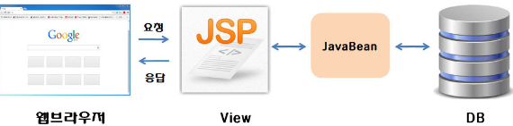
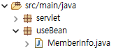
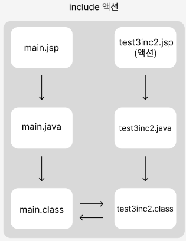

## 🧐 JSP 응용 (스크립트 & 액션태그)
### 🎓 JSP 스크립트란?
>- ***JSP***는 HTML과 자바 코드를 섞어 사용할 수 있는데, 이때 사용되는 **자바 코드**를 `스크립트 요소`라고 한다. 

<br/>

### ⚙️ 스크립트 요소
>- **'JSP가 서블릿 코드로 변환될 때'** → ***_jspService( ) 메서드 안에 들어간다.***
>- `JSP`에서는 일반 자바 코드와 달리 '멤버 변수나 메서드 선언은 기본적으로 불가능하다'❗

<br>

|스크립트 종류| 설명 |
|---|---|
| `<%! %>` | `선언 태그 (Declaration)` <br> - **변수와 메소드를 선언할 때 사용** <br> - 범위 : 페이지 내 어디서나 접근할 수 있는 전역 변수 및 메소드<br> - 멤버 변수나 메서드 선언이 필요하다면, **사용할 수는 있으나 '권장'하지 않는다.** |
| `<%= %>`⭐ | `표현 태그 (Expression)` <br>  - 웹 브라우저를 통해 **'클라이언트에 전달될(HTML 응답에 포함될)'** **[자바 표현식을 포함]** 한다. <br> - out.println() 인자로 적합한 모든 자바 코드를 작성할 수 있다. <br> - ***사칙연산, 메서드 호출, 변숫값 출력 등에 사용***된다. 👀 <br> - 변수나 메소드를 사용할 때 세미콜론(;)을 사용하지 않는다. |
| `<% %>`⭐ | `스크립트릿 태그(Scriptlet)` <br>  - **'자바 코드를 삽입'하기 위한 태그**이다. <br> - *모든 자바 코드 사용이 가능하다* <br> - HTML과 스크립트릿을 중간에 섞어 사용하는 것도 가능하다. <br> - ***"MVC 패턴 적용 및 JSTL + EL 태그로 대체 가능하다."***  |

```jsp
<%= strId%>
<%= dto.getUserId()%>

<% if(selectCnt == 1) { }%>

```

<br>

---

### 🎓 JSP 액션 태그란?
>- `액션 태그(Action)`는 JSP에서 ***'객체 생성과 공유'***, ***'페이지 이동과 전달'***, ***'태그 파일 작성 등'*** 에 필요한 기능을 제공하는 **[일종의 커스텀 태그]** 이다. <br> 

> - 표준 액션이라고 불리며, `커스텀 태그 기반`이지만 **"별도의 taglib 지시어 사용 없이 jsp 접두어를 사용"** 한다. 

>- ❗JSP의 역할이 축소된 현시점에서는 액션 태그를 실무에서 많이 활용하지 않는다. (알아두면 유용하긴 함)

<br/>

|액션 태그 종류| 설명 |
|---|---|
| `jsp:forward` | request와 response 객체를 포함해 다른 페이지로 포워드한다. |
| `jsp:include` | 다른 페이지의 실행 결과를 포함시킨다. |
| `jsp:useBean` | 자바 빈즈 객체를 생성하거나 불러온다. |
| `jsp:setProperty` | 자바 빈즈 객체의 속성(멤버 변수)에 값을 할당한다. |
| `jsp:getProperty` | 자바 빈즈 객체의 속성 값을 출력한다.  |
| `jsp:param` | include, forward 액션 사용 시, 파라미터 값을 수정하거나 추가한다. |

<br>

#### 💡 자바 빈 (Java Bean)
 <br/>

>- `자바의 재활용 가능한 컴포넌트 모델`을 말한다. 
>- **'POJO(Plan Old Java Object) 구조'** 로, ***[특정 기술이나 프레임워크에 종속 X]***, ***기본 생성자와 "멤버 변수에 대한 getter/setter 메서드를 제공"*** 하며, 직렬화할 수 있는 자바 클래스다. 

> 🪄 **[자바빈 구조의 특징]**
> - 인자가 없는 생성자(기본 생성자)로 구성된다. 
> - 파일 혹은 네트워크를 통해 객체를 주고 받을 수 있는 직렬화 구조가 가능하다.
> - getter, setter 메서드를 통해 멤버 변수(속성)에 접근한다. 

```java
// 자바 빈 구조
class Member {
    private int id;
    private String name;

    ...

    public void getId() {  // getter (get + 대문자 변수명)
        return id;
    }

    public void setId(int id) { // setter (set + 대문자 변수명)
        this.id = id
    }
}
```

<br>

#### 💡 useBean \<jsp:useBean>
 <br/>
>- `자바 빈 객체를 생성하거나 참조하기 위한 액션`을 말한다. 
>- ❗ JSP를 단순히 뷰 역할로만 사용한다면 사용할 일이 없다. 

<br>

#### 🔩 useBean 형식

```jsp
<%-- <jsp:useBean id="인스턴스 참조 변수" scope="page | request | session | application " class="패키지명.클래스명" type="패키지명.클래스명" beanName="패키지명.클래스명" /> --%>
```

<br>

|useBean 속성| 설명 |
|---|---|
| `id` | **[인스턴스를 참조하기 위한 변수명]** <br> - 자바 빈을 **'특정 scope에 저장하거나 가져올 때 사용하는 이름'** |
| `scope` | **[해당 클래스 타입의 객체를 저장하거나, 가지고 오는 범위]** <br> - 내장 객체의 일부 |
| `class` | **[생성하거나 참조하려는 객체의 클래스명]** <br>  ❗반드시 패키지 명까지 명시해야 함. <br> ❗추상 클래스나 인터페이스 사용 불가. |
| `type` | **[특정 타입의 클래스를 명시할 때 사용]** <br>  - **'추상 클래스나, 일반 클래스'** 가 될 수 있다. <br> - class 속성의 클래스에서 상속 혹은 구현이 이루어진다.  |
| `beanName` | type과 beanName 사용을 통해 class 속성을 대체할 수 있다. |

#### 🔩 useBean 활용

```jsp
<%-- 1. useBean 액션태그를 이용해서 객체 생성 --%>
<jsp:useBean id="info" class="useBean.MemberInfo"/>
```

```jsp
<%-- setProperty : HTML <form> 태그의 name 속성값을 해당 객체의 setter 메서드를 이용해 저장한다. --%>
<%-- property 속성에 *을 사용해 전체 변수를 한번에 지정한다.--%>
<jsp:setProperty  name="info" property="id" value="hong" /> 
<jsp:setProperty name="info" property="*" />

<%-- getProperty : getter 메서드를 이용해 value 값을 불러온다. --%>
<jsp:getProperty name="info" property="id"/>
```

<br>

#### 💡 include 액션 \<jsp:include>
>- include 액션은 include 지시어와 마찬가지로 다른 페이지를 포함하는 점이 동일하지만 처리과정에서 차이가 있다. 
>- `include 액션`은 **include 된 파일을 '각각 호출'해서 [처리된 결과만 포함해 보여주는 형식]** 이다. ***(즉, 컴파일을 따로해 각각의 서블릿 형태로 등록한다.)***

 <br/>
> https://velog.io/@kwangjin5468/JSP-include

```jsp
<!-- 쿼리 스트링: 이동할 페이지명.jsp?key=value&key=value -->
<jsp:include page="이동할 페이지명.jsp" flush="false">
    <jsp:param name="key명" value="value값"/>
</jsp:include>

<%= request.getParameter("key명") %>
```

<br>

#### 💡 forward 액션 \<jsp:forward>
>- forward 액션은 `클라이언트 요청을 다른 페이지로 전환`하는 액션으로 response.sendRedirection과 유사하다. 
>- 클라이언트 요청으로 다른 페이지로 이동하는 점은 유사하지마, 내부적으로는 차이가 있다. 

> **[sendRedirection]**
> - `서버`가 *클라이언트에게 새로운 페이지로 접속하라고* ***"요청을 보내고"***, `응답을 받은 클라이언트가` ***"다시 새로운 페이지로 접속하는 방식"***.
> - ***'단순 페이지 이동'*** 


> **[forward]**
> - 클라이언트가 새롭게 접속하는 것이 아닌, **서버에서 내부적으로 새로운 페이지로 이동**. → ***'페이지의 내용을'*** `클라이언트에게 응답으로 전달`
> - `[최초 request를 유지/request의 setAttribute( ) 속성값을 전달한 경우]` <br> ***'request 데이터를 저장 후' 페이지 이동을 해야하기 때문에*** forward 사용을 해야한다. 
```jsp
<!-- 쿼리 스트링: 이동할 페이지명.jsp?key=value&key=value -->
<jsp:forward page="이동할 페이지명.jsp" flush="false">
    <jsp:param name="key명" value="value값"/>
</jsp:include>

<%= request.getParameter("key명") %>
```
