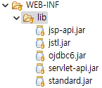
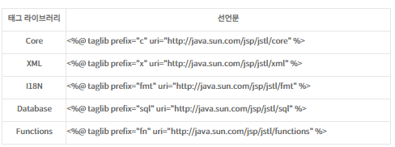
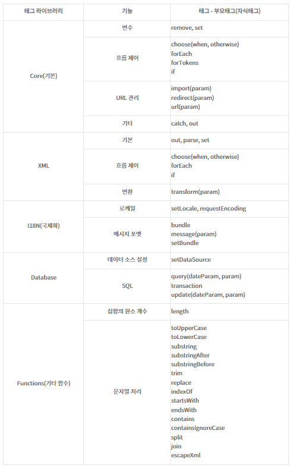

## 🧐 커스텀 태그 / JSTL
### 🎓 JSTL의 정의 ⭐
>- *'자바 서버 페이지' 표준 태그 라이브러리* (JavaServer Pages Standard Tag Library)
>-  `JSTL`은 **Java EE 기반의 웹 애플리케이션 개발 플랫폼**을 위한 컴포넌트 모음
>- JSP에서 **스크립트릿(자바코드블록)을 사용하지 않고**, **'HTML 형식을 유지하면서 조건문/반복문/연산 등을 손쉽게 사용'** 할 수 있는 `커스텀 태그 라이브러리`이다. 

>- **JAVA 코드인 스크립틀릿 방식** → **JSTL(+EL) 방식**으로 변환
>> 1.  `<%= Member %>` →  `${Member}`로 사용. 
>> 2. `<%= if %>`문을 →  `<c:if>`
>> 3. `<%= for %>`문을 →  `<c:forEach>`

<br>

### ⚙️ JSTL 사용 방식 
>- `JSTL`은 **pom.xml에 추가한 라이브러리 기능**이기 때문에,  java에서@import를 추가하는것처럼 **'taglib 지시어를 header에 추가'해주어야 사용이 가능**
```jsp
<%-- core 라이브러리 사용 --%>
<%@ taglib prefix="c" uri="http://java.sun.com/jsp/jstl/core" %>

<%-- functions 라이브러리 사용 --%>
<%@ taglib prefix="fn" uri="http://java.sun.com/jsp/jstl/functions" %>
```
> ❗JSTL 기능을 쓰기 위해서는 `jstl.jar` & `standard.jar`를 **WEB-INF/lib 폴더 안에 넣어야한다.** <br>
>  <br/>

#### 💡 태그 라이브러리 별 표준 선언문
>  <br/>
> https://atoz-develop.tistory.com/entry/JSP-JSTL-%EC%82%AC%EC%9A%A9-%EB%B0%A9%EB%B2%95-%EC%A3%BC%EC%9A%94-%ED%83%9C%EA%B7%B8-%EB%AC%B8%EB%B2%95-%EC%A0%95%EB%A6%AC

>  <br/>
> https://atoz-develop.tistory.com/entry/JSP-JSTL-%EC%82%AC%EC%9A%A9-%EB%B0%A9%EB%B2%95-%EC%A3%BC%EC%9A%94-%ED%83%9C%EA%B7%B8-%EB%AC%B8%EB%B2%95-%EC%A0%95%EB%A6%AC


<br>


